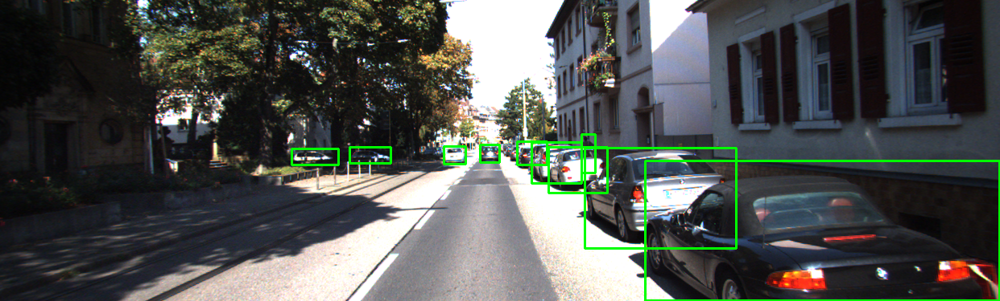
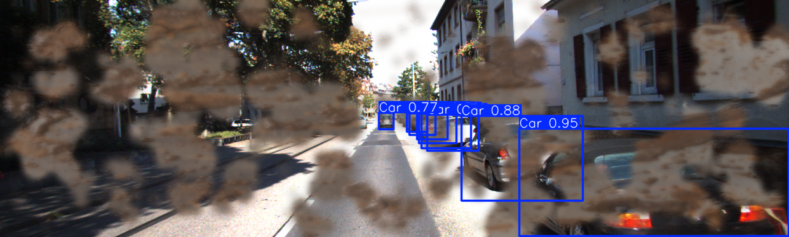

# Robust ADAS Synthetic Augmentation

  
  
   

### Project motivation

### Problem statement

### Visual abstract

### Dataset used

### Data augmentation and generation methods

### Input/Output Examples

### Models and pipelines used

### Training process and parameters

### Metrics

### Results

### Synthetic Contamination Results

### Repository structure

### Team Members