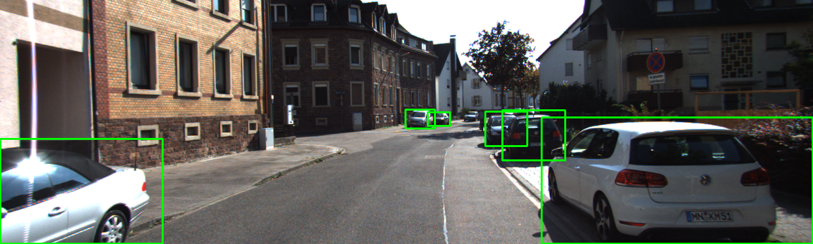
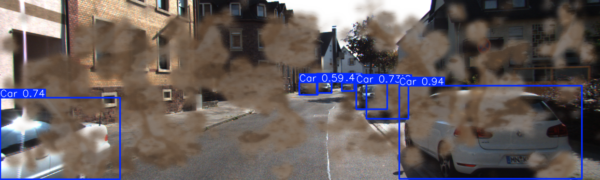
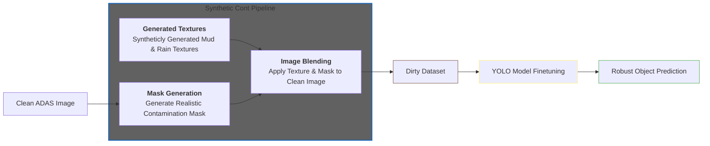

# Robust ADAS Synthetic Augmentation

  
  
   

This project focuses on enhancing the reliability of Advanced Driver Assistance Systems (ADAS) by addressing the "visibility gap" in computer vision. While modern object detection models perform exceptionally well in clear weather, their precision often collapses when faced with environmental hazards like rain or mud contamination.
To solve this, we developed a Robust Synthetic Augmentation Pipeline. Instead of relying on rare and expensive real world data collection, we engineered a suite of filters that simulate physical driving challenges on clean, high quality ADAS camera feeds.

### Visual abstract

### Dataset used

### Data augmentation and generation methods

### Input/Output Examples

### Models and pipelines used

### Training process and parameters

### Metrics

### Results

### Synthetic Contamination Results

### Repository structure

### Team Members
