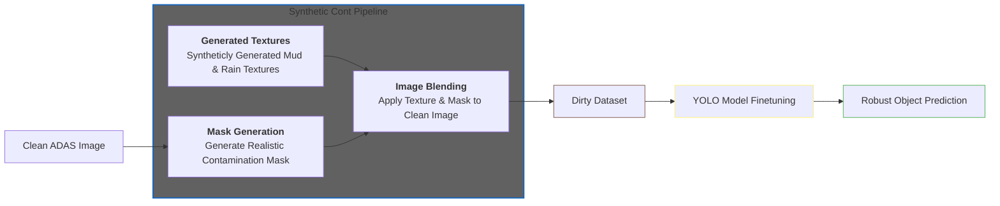
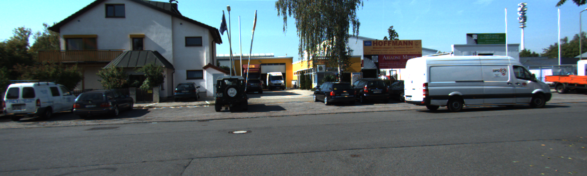
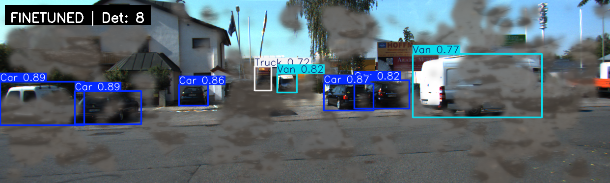
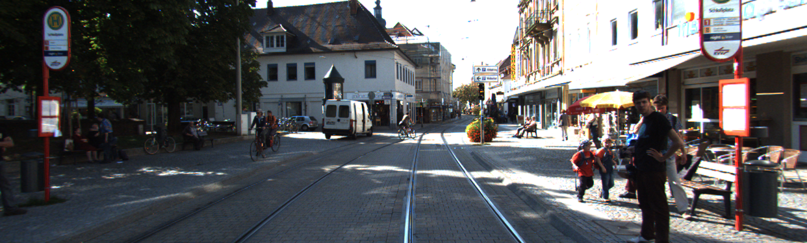
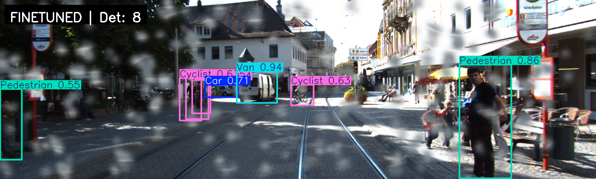
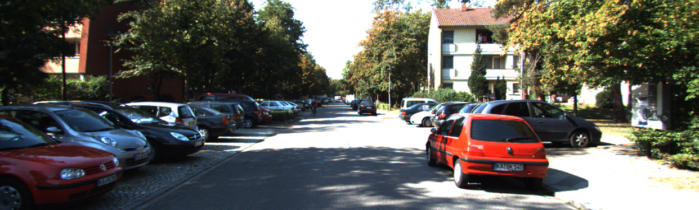
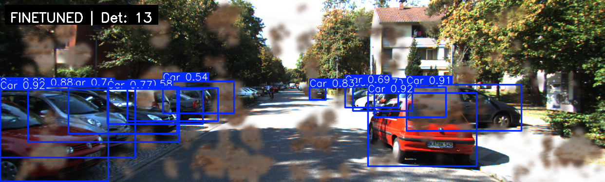

# Boosting ADAS Camera Robustness 🚗 🌧️

[](https://www.python.org/)
[](https://ultralytics.com/)
[](https://deepmind.google/technologies/gemini/)

## Project Motivation
Advanced Driver Assistance Systems (ADAS) often fail when the camera lens is obscured by mud, rain, or dirt. Since standard datasets are "clean," models exhibit significant performance gaps in real-world adverse conditions. This project aims to bridge that gap by using Generative AI to simulate lens corruption.

## Problem Statement
The "robustness gap" exists because manual acquisition of dirty lens data is physically demanding and hard to scale. We need a novel framework for **simulating complex dirty lens artifacts** via generative modeling to eliminate the need for manual data acquisition.

## Visual Abstract


## Datasets Used or Collected
* **KITTI Dataset:** The primary source for clean ADAS imagery.
* **Automated Dirty Dataset:** A custom-built set of **7,481 "dirty" images** generated by applying diverse mud and water overlays to the KITTI base.
* **Data Split:** 70% Train | 20% Val | 10% Test.

## Data Augmentation and Generation Methods
* **Modular Synthetic Data Engine:** Utilized Stable Diffusion and Gemini to generate high-fidelity, varied contamination textures (clumpy mud, dry streaks, rain droplets).
* **Mask Generation:** Designed realistic contamination masks that reflect real-world occlusion patterns, coverage, and spatial distribution.
* **Image Blending:** Programmatically blended textures and masks onto clean images to create synthetic edge-case datasets.

## Input/Output Examples
| Input | Output |
| :--- | :--- |
|  |  |
|  |  |
|  |  |

## Models and Pipelines Used
* **Model:** YOLOv8 (`yolov8n.pt`) chosen for real-time inference efficiency.
* **Pipeline:**
    1.  **Synthetic Contamination Pipeline:** Mask & Texture generation.
    2.  **Dataset Alignment:** Resizing and fitting labels to YOLO format.
    3.  **Fine-tuning:** Training on the augmented "dirty" dataset.

## Training Process and Parameters
* **Hardware:** Trained on NVIDIA-backed environments for ~60 epochs.
* **Input Resolution:** Resized to match YOLOv8 native requirements while preserving spatial consistency.
* **Learning:** Focused on recognizing objects like Cars, Trucks, and Pedestrians through heavy visual noise.

## Metrics
Success is measured by comparing performance on **corrupted footage** against standard pretrained baselines:
* **Precision:** TP / (TP + FP)
* **Recall:** TP / (TP + FN)
* **F1 Score:** Harmonic mean of Precision and Recall.
* **Mean Confidence Score:** The average certainty of detections.

## Results
The fine-tuned model significantly outperformed standard models on corrupted ADAS footage.

| Metric | Pretrained YOLOv8 | Fine-tuned (Our Model) |
| :--- | :--- | :--- |
| **Precision** | 0.5850 | **0.8413** |
| **Recall** | 0.5334 | **0.8403** |
| **F1 Score** | 0.5294 | **0.8256** |
| **Mean Confidence Score** | 0.7 | **0.8** |
| **mAP50** | 0.27 | **0.766** |

## Repository Structure
```text
├── code/               # Core implementation, scripts, and notebooks
├── data/               # Dataset storage and data processing utilities
├── gen_textures/       # Assets and scripts for synthetic texture generation (mud, rain)
├── results/            # Model outputs, performance metrics, and logs
├── slides/             # Project presentations and documentation materials
├── visuals/            # Images, diagrams, and examples used in the README
├── .gitignore          # Standard git ignore file
└── README.md           # Project documentation and overview
```